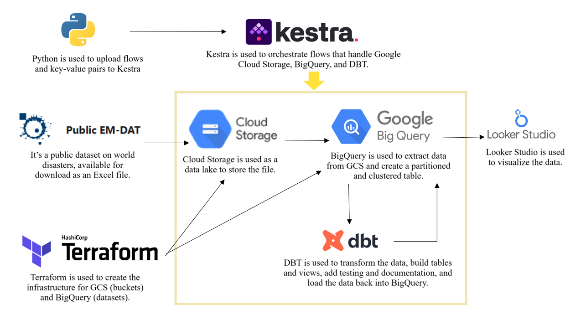
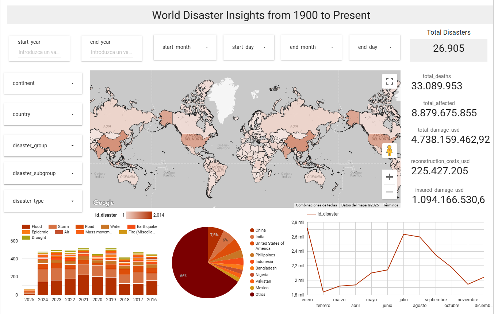

# World Disaster Data Pipeline

This is my submission for [Data Engineering Zoomcamp 2025](https://github.com/DataTalksClub/data-engineering-zoomcamp) final project.

## Problem Description

World Disaster is a public dataset containing information about natural and technological disasters worldwide. In this project, I have created a pipeline to process data from 1900 to the present to answer the following questions:

- Which countries have experienced the most disasters?
- What types of disasters are the most common over the years?
- In which months do disasters occur most frequently?
- How much economic damage does a disaster cause?
- How many deaths and affected people does a disaster cause?
- What is the total number of disasters recorded so far?

## Data

The data used in this project is extracted from [EM-DAT: The International Disaster Database](https://public.emdat.be/).

For a detailed description of the table structure and its columns, refer to the official documentation:  
[EM-DAT Public Table Schema](https://doc.emdat.be/docs/data-structure-and-content/emdat-public-table/#column-description)

## Technologies Used

- **Docker** (containerization)
- **Python** (Kestra environment automation)
- **Terraform** (infrastructure as code)
- **Kestra** (workflow orchestration)
- **Google Cloud Storage** (data lake)
- **BigQuery** (data warehouse)
- **dbt** (data transformation)
- **Looker Studio** (data visualization)

## Data Pipeline

## Data Visualization

View the Looker Studio dashboard [here](https://lookerstudio.google.com/reporting/10b79987-bfa2-4be1-9797-cdebd16eb74f).

## Setup & Reproduction

To replicate this project, follow these [instructions](docs/Instructions.md).

## 👤 Author  

**Valeria Q.M** 

